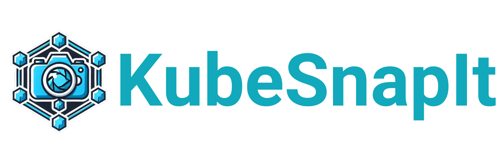

# Welcome to **KubeDockLauncher**! 

## Streamlined Kubernetes Management with KubeDeck Launcher

**KubeDeck Launcher** combines the powerful functionality of **KubeTidy** and **KubeSnapIt** into a single, easy-to-use PowerShell-based UI, making Kubernetes management faster and more efficient. Whether you're cleaning up unused resources in your kubeconfig file or managing snapshots, KubeDeck Launcher offers a user-friendly experience to automate and streamline your tasks.

With **KubeDeck Launcher**, you can:
- Use **KubeTidy** to clean up unused resources in your kubeconfig file, including stale contexts and clusters that are no longer needed. You can also export specific contexts into separate kubeconfig files or merge multiple kubeconfig files into one, all from the same UI.
- Access **KubeSnapIt** to capture, restore, and compare snapshots of your Kubernetes resources within an integrated, intuitive interface.
- Manage multiple clusters with ease, simplifying complex tasks in a unified tool.

## Why Use KubeDeck Launcher?

Managing Kubernetes environments typically involves juggling multiple tools and command-line workflows. **KubeDeck Launcher** simplifies this by providing a graphical interface that integrates the cleanup power of **KubeTidy** and the snapshot management features of **KubeSnapIt** into one seamless experience. KubeDeck Launcher helps you automate resource cleanup, snapshot management, and restoration tasks, enabling you to focus on managing your clusters more efficiently.

### Key Features of KubeDeck Launcher:
- **Unified Interface**: Manage both KubeTidy and KubeSnapIt from a single UI.
- **PowerShell-Based**: Built entirely with PowerShell, KubeDeck Launcher delivers an intuitive, reactive interface ideal for power users and automation workflows.
- **Snapshot, Restore, and Compare**: Leverage KubeSnapIt’s snapshot, restore, and comparison capabilities directly within the launcher.
- **Resource Cleanup**: Automate the cleanup of unused or outdated resources within your kubeconfig file using KubeTidy. This includes removing stale contexts, merging kubeconfig files, and more.

Check out our [Installation Guide](docs/installation) to get started or [Usage Documentation](docs/usage) to explore how you can use KubeSnapIt.

---

- [Installation](docs/installation)
- [Usage](docs/usage)
- [GitHub Repository](https://github.com/KubeDeckio/KubeSnapIt)
- [Changelog](docs/changelog)